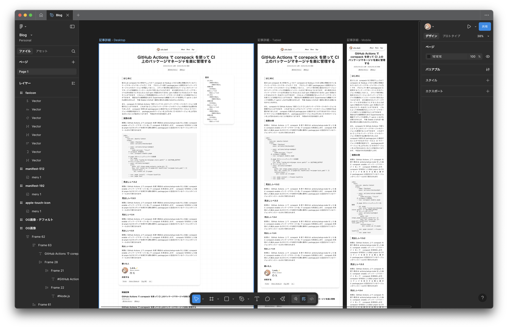

import { Details, Aside, LinkCard } from "@/components/posts";

## はじめに

この度、blog.s2n.techのブログシステムを大幅にリニューアルしました。
前回のv2から実に2年ぶりのリニューアルです。

そこで、今回はリニューアルの背景とその内容についてお話します。

## v2における問題点

v2には以下のような問題点がありました。

- Next.jsのApp Routerで作られているが、まだApp RouterやReact Server ComponentがExperimentalだった頃のNext.jsを使用している。
  バージョンを上げようにも、当時のApp Routerは現在と仕様が若干異なる部分があったり、RSCのベストプラクティスが定まっていなかった頃だったため、筋の悪い実装が多い。
- Edge RuntimeでのSSRを行っているが、エラーハンドリングが甘く、外部リソースを取得する箇所でエラーになるとページ全体がエラーになってしまう。
- Markdownの管理を独自のシステムで行っているため、ホットリロードが効かない。またEdge Runtimeの都合上、記事が増えるとEdge Runtimeに載らなくなる可能性がある(つまりスケールしない)。
- Remarkのパーサを利用しているが、独自拡張プラグインを大量に利用しているため、メジャーバージョンアップに追従できていない。
- ~~デザインがダサい~~

このような問題点があったため、v3では以下のような方針でリニューアルを行いました。

## v3の方針

- サーバーサイドの管理やエラーハンドリングが面倒なため、SSGをメインにし、完全な静的サイトを目指す。
- 独自記法は使用しない。Markdownで表現できない部分はMDXで表現する。
- パーサへの拡張を行う場合は公式or3rd partyのものを利用し、自作はなるべく行わない。
- 先にFigmaでデザインの大枠を決めておく。

これらの方針を踏まえて、v3の変更点を見ていきます。

## v3の変更点

### Next.jsからAstroへの移行

フレームワークを大幅に変更し、Next.jsからAstroへ移行しました。
AstroはSSGをメインにしたフレームワークで、デフォルトではクライアントサイドのJavaScriptを生成しません。
クライアントサイドでリッチな動きなどを行う場合は、ReactやVueなどを適宜導入することも可能です。

また、Astroの特に強力な機能として、Contents Collectionという機能があります。
これはMarkdownやMDXなどのファイルをコレクションとして管理し、CMSのように扱うことができる機能です。
これにより、面倒な記事データの管理をAstroに任せることができるため、データの管理が楽になります。
ホットリロードも効くので、記事の執筆もかなり楽になります。

### MDXの導入

今回はGitHub Flavored Markdown(GFM)以上のMarkdownの構文拡張は行わず、Markdown外の表現をしたい場合はMDXのコンポーネントを利用するようにしました。
といっても、追加したMDXコンポーネントは補足情報の表示や折りたたみ、リンクカードなどのようなもので、それほど多くはありません。

それでも拡張構文のパース処理などの手間が大幅に減ったため、かなりコードがシンプルになりました。

<Details summary="どんなコンポーネントがあるの？">
  この折りたたみなど、ZennやQiitaにあるようなものを追加しています。

  <Aside>
    こんな感じの補足情報の表示なんかもできたりします。
  </Aside>
</Details>

### Remarkプラグインの導入

構文拡張は行っていませんが、いくつかのプラグインは利用しています。どれもより良いレンダリングを得るためのものです。

- **remark-math**:
  数式用の記法を追加するプラグイン。
- **rehype-katex**:
  数式をレンダリングするためのプラグイン。今回はMathML形式の出力のみを行い、追加のCSSなどは利用しない方針です。
  MathMLのブラウザ対応はまちまちなので、極端にレンダリング結果がおかしい場合は戻すかもしれません。
- **remark-join-cjk-lines**:
  Markdownは空行がないと段落分けがされず、1段落として扱われる仕様がありますが、行の結合時に無条件で空白が挿入されてしまいます。
  CJKの場合はこの挙動があまり好ましくないため、このプラグインを利用してCJKの場合は空白を削除しています。
- **remark-cjk-friendly**:
  CommonMarkの仕様では、強調などのマークアップで前後に空白を挿れる必要があったりしますが、このプラグインを導入すると空白が不要になります。
  これにより、よりCJKでの執筆がしやすくなります。

### Expressive Codeの導入

[Expressive Code](https://expressive-code.com/)は読みやすいコードブロックコンポーネントを提供するライブラリです。
Astroとの統合機能があるため、すぐに導入できます。
コードブロックのファイル名表示やコピーボタンの追加、diff表示などの機能があり、まさにブログサイトに適したコードブロックです。

```typescript title="test.ts"
// Expressive Codeを使用すると、このようなコードブロックが作れます。
function hello(name: string): void {
	console.log(`Hello, ${name}!`);
}

hello("World");
```

### Tailwind CSSの導入

今回はスタイリングをTailwind CSSで行いました。v2ではCSS Modulesを利用していましたが、Tailwind CSSの方がデザイントークンの管理が楽です。
せっかくなのでこの前リリースされたTailwind CSS v4を利用しています。

もちろん素のTailwind CSSのデザイントークンをそのまま使用すると破綻するため、独自のデザイントークンを定義しています。

<Details summary="デザイントークンの定義(抜粋)">

```css title="src/styles/global.css"
@theme {
	--color-text-primary: var(--color-neutral-800);
	--color-text-secondary: var(--color-neutral-600);
	--color-text-heading: var(--color-neutral-950);
	--color-text-decoration: var(--color-neutral-500);
	--color-background-primary: var(--color-white);
	--color-background-secondary: var(--color-neutral-100);
	--color-background-tertiary: var(--color-neutral-200);
	--color-border-primary: var(--color-neutral-100);
	--color-border-secondary: var(--color-neutral-200);

	--color-info-text: var(--color-lime-900);
	--color-info-background: var(--color-lime-100);
	--color-info-border: var(--color-lime-200);
	--color-warn-text: var(--color-amber-900);
	--color-warn-background: var(--color-amber-100);
	--color-warn-border: var(--color-amber-200);
	--color-alert-text: var(--color-red-900);
	--color-alert-background: var(--color-red-100);
	--color-alert-border: var(--color-red-200);

	--font-cursive: var(--font-family-caveat), cursive, sans-serif;

	--leading-*: initial;
	--leading-tight: 1.25;
	--leading-normal: 1.5;
	--leading-relaxed: 2;

	--bg-grid:
		linear-gradient(0deg, var(--color-border-primary) 1px, transparent 1px),
		linear-gradient(90deg, var(--color-border-primary) 1px, transparent 1px);
}
```

</Details>

### Figmaでのデザイン

今回は前もってFigmaでデザインを決めておき、それをもとにコーディングを行いました。
事前に入念にプロトタイピングを行ったため、PC・モバイル共に読みやすいデザインになったかなと思っています。



なお、今回はデザインの方針として、色の使用を極力控えるようにしました。
個性がない方が、記事の読みやすさに集中できると考えたためです(流石にちょっと色がなさすぎるので、そのうちアクセントカラーを入れるかもしれませんが…)。

### OG画像の生成

v2と同様に、satoriを利用してOG画像(SNSなどで共有した際に使用される画像)を生成しています。
v2のときは独自のOG画像生成用のエンドポイントを用意して、クエリパラメータでデータを渡して動的生成していましたが、
v3ではAstroの[エンドポイント](https://docs.astro.build/en/guides/endpoints/)を利用して静的生成しています。

v2のときはEdge Runtimeに含めるためにフォントデータをオンデマンドで取得するなどなかなか苦しい実装でしたが、v3では事前生成でサイズ制限などを気にする必要がないため、フォントデータを思いっきり含めています。

<LinkCard href="https://github.com/shun-shobon/blog.s2n.tech/blob/73e09a5236974f911d74c83661cb89f399bdae96/src/libs/og-image.tsx" />

## 今後やりたいこと

とりあえずひとまずの機能は実装できていますが、まだまだ追加したい・改善したい箇所をたくさんあります。

- ダークテーマ
- 記事の検索機能
- 関連記事の表示

## まとめ

v3で大幅にリニューアルしたことで、メンテナンス性が向上し、記事の執筆もかなり楽になりました。
記事執筆のモチベも高まったので、この調子で最近おざなりになっている執筆活動を頑張っていきたいと思っています！
