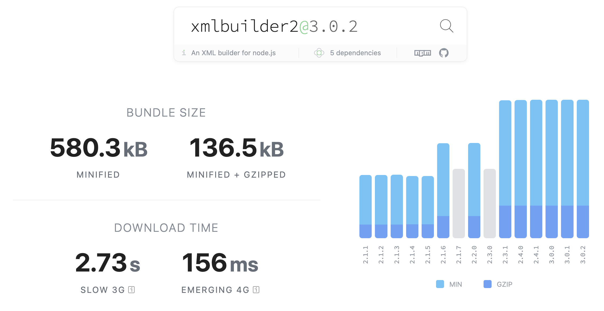
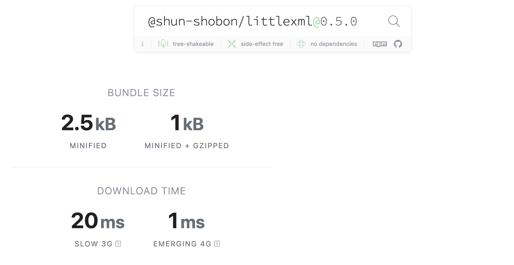
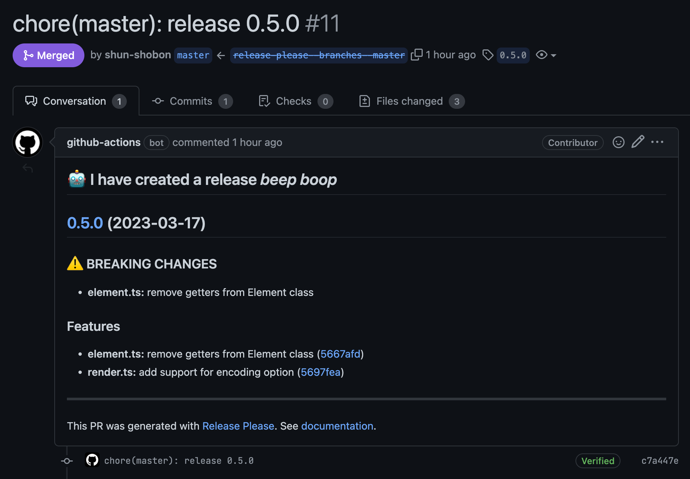

import { LinkCard } from "@/components/posts";

## はじめに

[littlexml](https://github.com/shun-shobon/littlexml) という軽量の XML ビルダーをリリースしました。
Cloudflare workers などの Edge ランタイムでの動作を考慮していますが、Node.js, Deno, Browser でも動作します。
また通常の文字列としての出力以外にも Iterator や Web Stream API を使った出力もサポートしています。

<LinkCard href="https://github.com/shun-shobon/littlexml" />

使い方は非常にシンプルで、メソッドチェーンを使って XML を構築します。
以下はサイトマップを出力する例です。

```ts
import { element, renderToString } from "@shun-shobon/littlexml";

const root = element("urlset")
	.attr("xmlns", "http://www.sitemaps.org/schemas/sitemap/0.9")
	.attr("xmlns:image", "http://www.google.com/schemas/sitemap-image/1.1")
	.child(
		element("url")
			.child(element("loc").text("https://example.com/"))
			.child(element("lastmod").text("2020-01-01"))
			.child(element("changefreq").text("daily"))
			.child(element("priority").text("0.8"))
			.child(
				element("image:image")
					.child(element("image:loc").text("https://example.com/image.png"))
					.child(element("image:caption").text("caption")),
			),
	);

const xml = renderToString(root, { version: "1.0", indent: 2 });

console.log(xml);
```

コンソールには以下のように出力されます。

```xml
<?xml version="1.0" encoding="UTF-8"?>
<urlset xmlns="http://www.sitemaps.org/schemas/sitemap/0.9" xmlns:image="http://www.google.com/schemas/sitemap-image/1.1">
  <url>
    <loc>https://example.com/</loc>
    <lastmod>2020-01-01</lastmod>
    <changefreq>daily</changefreq>
    <priority>0.8</priority>
    <image:image>
      <image:loc>https://example.com/image.png</image:loc>
      <image:caption>caption</image:caption>
    </image:image>
  </url>
</urlset>
```

## なぜ作ったのか

最近はよくこのブログサイトを弄ってるのですが、RSS やサイトマップの生成に XML を使用します。
RSS やサイトナップを出力できるライブラリはたくさんあるのですが、
このサイトで使っている RSS 用のライブラリは Edge ランタイムで動作せず、
サイトマップ用のライブラリは ~~XML のエスケープが雑なせいで~~ 正しい出力ができませんでした。
また既存の XML ライブラリはどれも古く、Tree Shaking などに対応していないものが多かったので
それならば自分で作ったほうが良いのではないかと思い作りました。

実際に bundlephobia.com で比較してみると、xmlbuilder2 は minified + gzipped で 136.5kB であるのに対して、
littlexml は 1kB と非常に小さいことがわかります。





また、Edge ランタイムなどのメモリ制限がある環境で動作させる場合はメモリをある程度節約する必要がありますが、
RSS やサイトマップはサイズが非常に大きくなる可能性があります。
そこで littlexml では Iterator や Web Stream API を使った出力もサポートしています。
特に Web Stream API は Response オブジェクトに直接渡すことができるので、
Cloudflare Workers などの環境で扱いやすいと思います。

## 実装

### 文字列の出力

littlexml では基本的な出力は全て Iterator を使って実装しており、
文字列や Stream での出力はそれを利用して実装しています。

Iterator の出力には[ジェネレータ関数](https://developer.mozilla.org/ja/docs/Web/JavaScript/Reference/Statements/function*)を使っています。
ジェネレータ関数では `yield` を使って Iterator の値を出力できます。
また、 `yield*` を使うことで別の Iterator をそのジェネレーター関数の値として出力することができます。
(ちなみに class のメソッドで使う場合、`function`が省略されるためメソッド名の前に`*`をつけるだけになります。)

```ts
// XMLの要素を表すクラス
class Element {
	#name: string;
	#attributes: Map<string, string> = new Map();
	#children?: Content;

	constructor(name: string) {
		this.#name = name;
	}

	// 文字列のIteratorを出力する
	*toStringIterator(
		indentType: IndentType,
		level: number,
	): IterableIterator<string> {
		const indent = createIndent(indentType, level);

		yield `${indent}<${this.#name}`;

		for (const [key, value] of this.#attributes.entries()) {
			yield ` ${key}="${escapeStr(value)}"`;
		}

		if (this.#children === undefined) {
			yield " />";
			return;
		}

		if (typeof this.#children === "string") {
			yield `>${escapeStr(this.#children)}</${this.#name}>`;
			return;
		}

		yield ">";
		for (const child of this.#children) {
			yield* child.toStringIterator(indentType, level + 1);
		}
		yield `${indent}</${this.#name}>`;
	}
}
```

はじめは文字列を直接出力する関数と Iterator を出力する関数を分けていましたが、
[ベンチマークを取ってみたところ](https://github.com/shun-shobon/littlexml/blob/59241eb0b0c3ccb8e41d41d85e681c154e9be0e5/render_bench.ts)、
直接文字列を出力する場合と Iterator を文字列に変換する場合で速度の差が大して無かったので、 Iterator を出力する関数のみに統一しました。
Deno はベンチマークやテストの実行が組み込まれているので、とても開発体験が良いです。

```
> deno bench
Check file:///Users/shun_shobon/projects/github.com/shun-shobon/littlexml/render_bench.ts
cpu: Intel(R) Core(TM) i7-8569U CPU @ 2.80GHz
runtime: deno 1.31.2 (x86_64-apple-darwin)

file:///Users/shun_shobon/projects/github.com/shun-shobon/littlexml/render_bench.ts
benchmark                                                              time (avg)             (min … max)       p75       p99      p995
--------------------------------------------------------------------------------------------------------- -----------------------------
rendering element (_stringifyElement)                              205.83 ms/iter (157.38 ms … 227.41 ms) 220.92 ms 227.41 ms 227.41 ms
rendering element (elementToStrings)                                52.79 ms/iter   (34.08 ms … 92.89 ms)  58.76 ms  92.89 ms  92.89 ms
rendering element (elementToStrings and .join)                     213.01 ms/iter (185.61 ms … 251.94 ms) 226.44 ms 251.94 ms 251.94 ms
rendering element (elementToStrings and +)                         224.94 ms/iter (197.48 ms … 254.17 ms) 236.32 ms 254.17 ms 254.17 ms
rendering element (elementToStrings and .concat)                   229.04 ms/iter (201.94 ms … 261.78 ms) 253.23 ms 261.78 ms 261.78 ms
rendering element (elementToStrings and template literal strings)  228.92 ms/iter (202.16 ms … 259.65 ms)  232.4 ms 259.65 ms 259.65 ms
```

### Stream の出力

Stream の出力には Web Stream API を使っています。
Web Stream API は ブラウザ標準の API で、Node.js でも Experimental な機能ながらも利用できます。

読み出し可能なストリームを作成するには、 `ReadableStream` を使います。
`ReadableStream` のコンストラクタにはいくつかの関数を渡すことができ、読み出し時にそれらの関数が呼ばれます。

```ts
export function renderToStream(
	root: Element,
	options?: RenderOption,
): ReadableStream<string> {
	// Iterator を作成
	const iterator = renderToIterator(root, options);

	// ReadableStream を作成
	return new ReadableStream({
		// 内部キューがいっぱいになっていないときに呼ばれる関数
		pull(controller) {
			// Iterator から値を取り出す
			const { done, value } = iterator.next();
			if (done) {
				// Iterator が終了したらストリームを閉じる
				controller.close();
			} else {
				// Iterator から取り出した値をストリームの内部キューに追加する
				controller.enqueue(value);
			}
		},
	});
}
```

`start` はストリームが開始されたときに呼ばれ、 `pull` はストリームの内部キューがいっぱいでは無いときに呼ばれます。
今回は `start` は使っていませんが、ストリームの開始時に何か処理をしたい場合に使います。

今回作成した `renderToStream` は 文字列の `ReadableStream` を返すので、
`Response` などで利用する場合は文字列からバイナリに変換する必要があります。

```ts
const root = element("urlset")
	.attr("xmlns", "http://www.sitemaps.org/schemas/sitemap/0.9")
	.attr("xmlns:image", "http://www.google.com/schemas/sitemap-image/1.1")
	.child(
		element("url")
			.child(element("loc").text("https://example.com/"))
			.child(element("lastmod").text("2020-01-01")),
	);

// 文字列のストリームを作成
const strStream = renderToStream(root);
// TextEncoderStream を使ってUTF-8のバイナリストリームに変換
const binaryStream = strStream.pipeThrough(new TextEncoderStream());
// Response に渡す
const response = new Response(binaryStream);
```

### Deno のコードを npm パッケージにする

今回は Deno を使って開発しましたが、これを Node.js やブラウザなどで利用できるようにするには npm パッケージとして公開する必要があります。
これには Deno 公式の [dnt](https://github.com/denoland/dnt) というツールを使用しました。
dnt は Deno のコードを npm パッケージに変換するツールで、簡単に npm パッケージに変換できます。

```ts
import { build, emptyDir } from "https://deno.land/x/dnt@0.33.1/mod.ts";

// 出力先を初期化
await emptyDir("./npm");

await build({
	// 入力ファイル
	entryPoints: ["./mod.ts"],
	outDir: "./npm",
	// テスト用にNode.js向けのDenoのpolyfillを追加
	shims: {
		deno: {
			test: "dev",
		},
	},
	// tsconfig.jsonの設定
	compilerOptions: {
		lib: ["dom", "esnext"],
	},
	// package.jsonの設定
	package: {
		name: "@shun-shobon/littlexml",
		version: "0.5.0",
		main: "./script/mod.js",
		unpkg: "./esm/mod.js",
		sideEffects: false,
	},
});

// LICENSEとREADME.mdをコピー
Deno.copyFileSync("LICENSE", "npm/LICENSE");
Deno.copyFileSync("README.md", "npm/README.md");
```

dnt は Deno のコードを npm で利用できるコードに変換してくれます。コードは ES Module 用と CommonJS 用の 2 つのバージョンに変換されるので、
Node.js でもそのまま利用できますし、バンドラが Tree Shaking などの最適化を行いやすくなります。
`package.json`なども出力されるので dnt を実行したあとはそのまま npm に公開できます。
ちなみに dnt はコードの出力後、テストコードがある場合は Node.js 上でもテストを実行してくれるため安心です。

### リリースワークフロー

今回は GitHub Actions を使ってリリースワークフローを作成しました。
npm は npmjs.org と pkg.github.com への公開、
Deno は GitHub でのリリースの作成によって公開されるため、
それらを簡単に行えるように Google の [release-please-action](https://github.com/google-github-actions/release-please-action) を利用しました。
release-please-action は master へのマージやコミットによって発火し、リリース用の PR を自動で作成します。



この PR にはリリースされるまでに master で行われた変更から生成された CHANGELOG が含まれています。
また、設定によって指定したファイルのバージョンを自動で更新してくれます。
今回は README のサンプルで書かれているバージョンと dnt で使用しているバージョンを自動で更新するようにしました。

この PR をマージすると、release-please-action が GitHub にリリースを作成します。
release-please-action はあくまでもリリースを作成するだけですが、
リリースを作成した際に GitHub Actions の outputs にリリースされたことが通知されるため、
それを利用してリリースが作成されたタイミングで npm のパッケージを公開するしています。

```yaml
jobs:
  release-please:
    runs-on: ubuntu-latest
    steps:
      - uses: actions/checkout@v3

      # release-please-action でリリース用の PR を作成 & リリースを作成
      - uses: google-github-actions/release-please-action@v3
        id: release
        with:
          # リリースのタイプ、simple以外にもpackage.jsonを自動で更新するようなものもある
          # 通常のNode.jsのパッケージの場合にはそれを使うとよい
          release-type: simple
          # Denoで利用するためタグにvをつけない
          include-v-in-tag: false
          # まだメジャーバージョンが1未満のため破壊的変更もマイナーバージョンを上げる
          bump-minor-pre-major: true
          # リリース用の PR で一緒にバージョンを更新するファイル
          extra-files: |
            README.md
            scripts/build_npm.ts

      # リリースが作成されたときにのみ発火する
      - if: ${{ steps.release.outputs.release_created }}
        # npm パッケージを公開するローカルのアクション
        uses: ./.github/actions/npm-publish
        with:
          github-token: ${{ secrets.GITHUB_TOKEN }}
          npm-token: ${{ secrets.NPM_TOKEN }}
```

## 最後に

今回は Deno で XML を扱うためのライブラリを作成しました。
Deno はエコシステムが組み込まれているため、Node.js に比べて開発体験が非常に良いです。
あまり外部 IO に依存しないライブラリならば、Node.js で作るよりも Deno で作った方が楽だと思います。
また今回の開発を通して Web Stream API の利用方法を学ぶことができました。
作成したライブラリを使って RSS やサイトマップを生成するライブラリも今後作成していきたいと思います。
