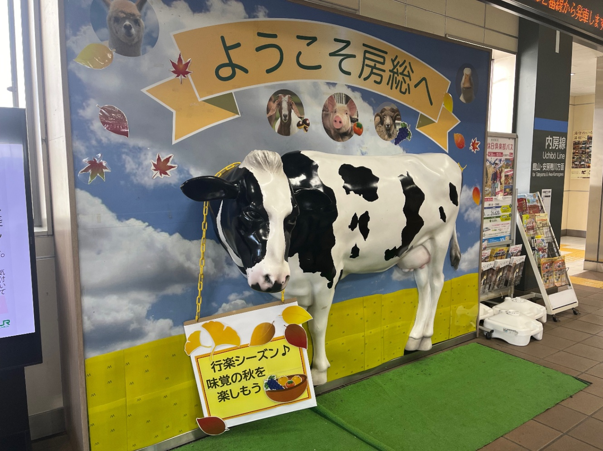

import { Aside, Tweet } from "@/components/posts";

<Aside type="warn" title="おことわり">
	この記事は[しずかなインターネット](https://sizu.me/shun_shobon/posts/mb6wcwc2bzfz)にて公開した記事を転載したものです。
</Aside>

毎年恒例の振り返りです。去年までは自分のブログに書いてましたが、自分のブログは諸々改修中なので今年は静かなインターネットに書こうと思います。

去年までの振り返りは下のリンクからどうぞ。

- [2021年の振り返り](https://blog.s2n.tech/posts/review-2021)
- [2022年の振り返り](https://blog.s2n.tech/posts/review-2022)
- [2023年の振り返り](https://blog.s2n.tech/posts/review-2023)

例年通り、(だいたい)時系列順に並んでいます。

## 成人式に行った

去年の4月に20歳になり、今年の1月に成人式がありました。
久しぶりに中学の友達と再会し、近況を報告しあえて楽しかったです。
今後も毎年同窓会やろうぜ！みたいなことを言い合って、まあ一時のノリだよなあと思ってたんですが、本当に来年の1月に同窓会をやるみたいなので、なんだかんだ中学の友達はいい奴らだなあと思ったりしています。

## 高専を卒業した

5年間通った高専を卒業しました。
文句言いながらも、なんだかんだで楽しかった5年間。
卒業研究は最終発表会の1週間前にようやく成果がでたりと卒業できるかギリギリな感じでしたが、なんとかやり切ることが出来ました。

## Web Speed Hackathon 2024に出た

Web Speed Hackathon 2024に出場しました。
Web Speed Hackathonはめちゃくちゃ重たいWebアプリを(主に)フロントエンドの改善で速くする競技です。
初めて参加したのですが、スコア的には2位になれました。
ですが、残念ながら最後の手動チェックでレギュ違反が発覚し失格となってしまいました…ReDoSの改善で正規表現を変えたときに本来と異なる挙動にしてしまったので、やはり正規表現は人類には難しいですね…

<Tweet href="https://twitter.com/shun_shobon/status/1771863666473750877" />

## 一人暮らしを始めた

3月に大学に通うために長野から東京に引っ越しました。
20年間住んだ長野を離れ初めての一人暮らし。
実家に居た頃は自炊も掃除も全然しなかったので全てが初めてで始めの一ヶ月はかなり苦戦しました。
今でも正直自炊はかなり面倒ですが、最低限の生活力は手に入れたかなと思っています。

## 東京農工大学に進学した

長野高専を卒業した後は、東京農工大学に編入学しました。
正直最初は高専も大学も大して変わらないだろうと思っていたのですが、高専よりも圧倒的に自由度が高く、今では大学に進学して本当に良かったなと思っています。

ちなみにサークルはマイクロコンピュータクラブ(MCC)に入りました。
何故か入る前からすでにサークル内で自分のことが話題になっていたらしく、サークル説明会で熱烈な歓迎を受けました。

この後話しますが、サークルでハッカソンに出たり、合宿したり、学祭に展示したりと、入って一年目&編入生ですがめちゃめちゃサークルに参加しています。
ここまでサークルに入り浸る編入生もなかなか居ないと思いますが、逆に編入生でも暖かく迎えてくれるサークルなので農工大に編入する編入生はぜひMCCに入ってください！

## ネットワークスペシャリストになる

春に受けたネットワークスペシャリスト試験に合格し、ネットワークスペシャリストになりました。
新生活を始めたばかりでほとんど勉強できなかったのですが、何故か合格でした。
IPAの試験は合格を取るのが大事というより、その勉強過程が重要だと思っているのであまり意味がないような気もしています。

<Tweet href="https://twitter.com/shun_shobon/status/1808700056054432095" />

## 内定が出る

6月あたりに第一志望から内定が出て、それを承諾しました。
3年生の6月なので、普通よりかなり早い時期の内定でした。
まだまだ先とは言え、ひとまず進路が決まりちょっと安心しました。

## ハッカソンに出る

MCCの有志6人でOpen Hack U 2024 TOKYO Vol.2に参加しました。
自分としてはかなり久しぶりのハッカソンで、初心者を連れての参加だったので勝手が分からなくて結構苦戦しましたが、なんとか発表日前に完成させることが出来、良かったです。

特に賞には引っかかりませんでしたが、個人的には満足行く作品ができたかなと思っています。

## Web Developers Conference 2024で登壇した

Jxckさん主催のWeb Developers Conference 2024の1分 de Web標準で登壇しました。
1分×2つとかなり短い枠でしたが、初めての技術イベントでの登壇でちょっと緊張しました。
これを活かして、今後はもっと他のイベントとかでも登壇できたらいいなあと思っています。

## サークルの夏合宿に参加した

サークルの夏合宿に参加しました。
初めて南房総に訪れ、海が近くて結構テンションが上りました(内陸県民あるある)。
合宿ではバーベキューしたり、ハッカソンしたり、競プロしたり、海行ったりと高密度な3日間を過ごしました。
ハッカソンは、我々のチームは残念ながら最後まで完成させることは出来ませんでしたが、自分は初めての技術を使えて、チームメイトにもWeb技術に触れてもらえて、当初の目的は達成できたかなと思っています。

## 学祭にゲームを出展する

農工大では11月に農工祭という学園祭があります。
MCCでは毎年ゲームの展示をしていて、今年もゲームを作って展示しました。

今年は自分というWebができる人間が居たのでWebアプリとも連携できるゲームにしよう！ということになり、
Webアプリでユーザー作成&キャラカスタマイズ→ゲーム筐体にQRコードをかざして参加！→スコアやランキングはプレイ後Webアプリで見れるというようなものになりました。

自分はUIデザイン・Webアプリ・DB設計をやりましたが、完成するのが本当にギリギリで、最後までデバッグ作業や実装を進めていました。

Unity班は学祭当日も頑張っていて、正直100%の状態で出せたとは言い難いので、来年はもう少し余裕を持って開発に望みたいです。

## 技育展に出場する

Hack Uで作った作品を何処かに出したいねという話になり、ちょうど技育展の作品募集があったので応募しました。
技育展は1回戦→2回戦→決勝という流れになっていて、正直2回戦くらいで落ちるかなーと思っていたのですがなんと決勝まで進んでしまいました。

決勝は六本木にあるビルの最上階で開催されました。めちゃくちゃ豪華な会場でかなり驚きました。

結果としては特に賞には引っかかりませんでしたが、他の方々のすごい作品を見ることができ、開発欲が高まったいい機会だったかなと思います。

## アルバイトを辞めた

去年よりお世話になっていたピクシブ株式会社を退職しました。
不満があったというわけではなく、別の道に進みたいという思いからの退職でした。
長期間開発に携わることができ、業務としてのプログラミング・エンジニアリングをたくさん学ぶことができたと思っています。

## アルバイトを始めた

12月より、新しい会社でアルバイトを始めました。
まだまだ始めたばかりで、慣れないことも多いですが、これから頑張っていこうと思っています。

## ISUCON14に参加した

ISUCONに参加しました。
友人3人と申し込みましたが、1人が用事で参加できなくなってしまい、2人での参加となりました。

初参加で特に予習もせず、何も勝手が分からない状態での参加でしたが、過去の偉人達の参戦記を参考にしつつ、頑張ったことで最終的には学生2位のスコアを取ることができました。

ですがコンテスト後の再起動チェックで不可となってしまい、失格となってしまいました…正直再起動でデータが消えるような改善はしていないはずなので謎ですが、今回学んだことを活かして来年は入賞したいですね。

<Tweet href="https://twitter.com/shun_shobon/status/1865744053079584827" />

## コミケに参加した

冬コミ c105に参加しました。
初めての参加で何も分からず、入場のためのリストバンドを買いに前日に東京を奔走することになってしまいました。
ただ、お目当てのグッズを手に入れたり、企業ブースを回ったりとコミケの雰囲気を知って楽しむことが出来ました。

また、私の所属しているコミュニティである「限界開発鯖」の合本にも寄稿しました。供給側と消費側の両方のオタクになった2日間でした。

## いろいろなイベントに参加した

今年はいろんな技術イベントに参加した年でもありました。
東京に引っ越して、イベントに気軽に参加できるようになったのが大きいです。
イベントの参加は都心に近い大学に進学したかった理由でもあったので、結構嬉しかったです。
やっぱりオフラインでの参加のほうが、話が入ってくるし、懇親会でいろいろな人と知り合ったりできるしで、いいなあと思います。

## 終わりに

今年はとにかくたくさんの出来事があった年でした。
特に一人暮らしを始めて、活動範囲が広くなったことが大きかったと思います。
来年は卒研があったり、バイトも頻度が増えて忙しくなってくるかなと思っていますが、イベント登壇や記事執筆などエンジニア的な活動を増やせていけたらなあと思っています。
